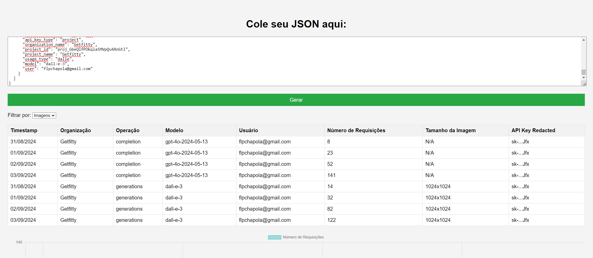

# JSON Data Visualizer

## Overview

This application allows you to visualize your OpenAI usage data by generating tables and charts from JSON data. You can easily copy and paste your usage data from the OpenAI dashboard to see your activity represented visually.

## How to Use

### Step 1: Export Data from OpenAI Dashboard

1. Go to the OpenAI usage activity dashboard: [OpenAI Dashboard](https://platform.openai.com/organization/usage/activity).
2. Export your usage data in JSON format.
3. Copy the JSON data to your clipboard.

### Step 2: Paste JSON Data

1. Open the JSON Data Visualizer application.
2. In the provided text area, paste the JSON data you copied from the OpenAI dashboard.

### Step 3: Generate Visualizations

1. Click the **Generate** button.
2. The application will create a table displaying your usage data.
3. You will also see a bar chart representing the number of requests over time.

### Step 4: Filter Data

1. Use the dropdown menu to filter the data by usage type (e.g., Text or Images).
2. The chart and table will update automatically based on your selection.

## Features

- **Table Display**: View your usage data in a structured table format.
- **Bar Chart Visualization**: Visualize the number of requests over time with an interactive bar chart.
- **Filtering Options**: Filter the data by usage type to focus on specific metrics.

## Requirements

- A modern web browser (Chrome, Firefox, Safari, etc.).
- Internet connection to access the OpenAI dashboard.

## Troubleshooting

- If you encounter any issues with JSON formatting, ensure that the data is correctly structured as per the OpenAI export format.
- Make sure your browser allows JavaScript to run, as the application relies on it for functionality.

## License

This project is licensed under the MIT License.
